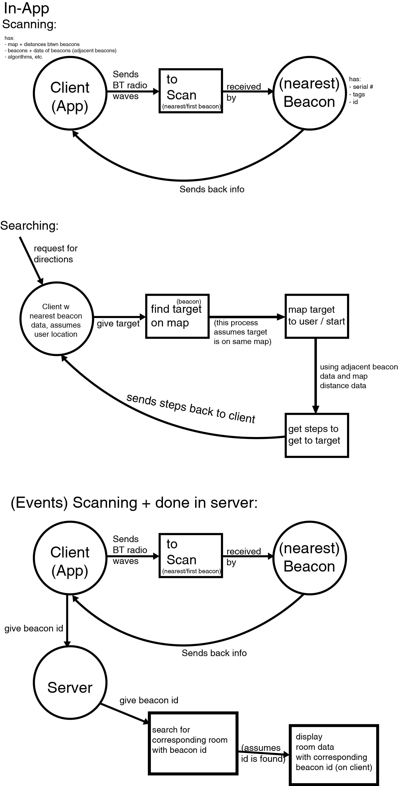

# Indoor Navigator

### Collaborators and Positions:
| Name | Position |
|---|---|
| Tommy | Webserver / Database |
| Yohen | Displaying Map |
| Jennifer | Plotting Map |
| Raghav | User positioning / Calculations |
| Kathryn | PM, UI UX |

More info on positions: 
- Back-end Server side - calculation, steps, plotting on map
- Front-end Client side - UI, map

### Goal of Project:
#### To create a web-app that users can use to be able to navigate from one position to another in one building.

### Weekly Progress:
- Week 1 (May 27 to June 2): 
  
  | Completed | Task | Assignment |
  | ---- |------|-----------|
  | :+1: | Create Github Repo | Kathryn |
  | :+1: | Create README Document | Kathryn |
  | :+1: | Read about Estimote + SDK | Everyone |
  | :+1: | Decide to work on existing project or from scratch | Everyone |
  
  - [ ] To do next week:
  
  | Task | Assignment |
  |------|-----------|
  | ?? | ?? |
  
- Week 2 (June 3 to June 9): 
  
  | Completed | Task | Details | Assignment |
  | ---- |------|-----------|---|
  | :+1: | Create System Design (Level 1) | How would the client side comm. w/ the server side? | Everyone |
  | :+1:  | Decide who does what | Server side, Client side | Everyone |
  |  | Connect SDK to web app | SDK is mobile based, figure out how to make it web based | Everyone |
  | :+1: | Decide language use to build this web application | Abdallah suggested: PHP, JavaScript, HTML | Everyone |
  |  | How should we make a map? | Options: use a vector image (like google maps) or find use an existing map API | Everyone |
  
  - [ ] To do next week:
  
  | Task | Assignment |
  |------|-----------|
  | Check if Abdallah received Beacons | Everyone, Jennifer |
  | Be familiar w Javascript + React | Everyone |
  | Read on EvoThings | Everyone |
  | System Design Level 2 | Kathryn |
  
  Meeting notes: Start from scratch, Project should use a small area of some building to test
  
  **Meeting notes 2**: Not enough resources on web-application with bluetooth - starting with mobile application (made w js) then transition to web app. Use JS so easy to transition to web app later on. Everyone will be back in July so we all can work with the Beacons, physically.
  Use Evothings Studio, an IoT IDE, compatible with Estimote beacons
  
- Week 3 & 4 (June 10 to June 22): 
  
  | Completed | Task | Details | Assignment |
  | ---- |------|-----------|---|
  | :+1: | Read the report | To get ideas on what challenges we might face | Everyone |
  | | Learn JS (if not familiar) | Build a simple app (with Evothings/PhoneGap) that takes data from estimote beacons. Extra goal: Build app that sends dummy data to test server, decide libraries later | Everyone | 
  | :+1: | Try out Evothings | As above | Everyone |
  | | Build simple server | Using Java or PHP | Everyone |
  | :+1: | System Design Level 2 | can be done anytime | Kathryn |
  
  - [ ] To do next week:
  
  | Task | Assignment |
  |------|-----------|
  | As Above | All |
  
- Week 5 (June 23 to July 3 (Wednesday) ): 
  
  | Completed | Task | Details | Assignment |
  | ---- |------|-----------|---|
  | | Build test map | The test map will be an array of dummy Nodes as JSON objects (eg. Shortest-path). These dummy nodes (JSON Objects) should contain: id, xy coordinates, type of room (Room/Hallway), events, adjacent nodes, and other data if any. | Jennifer, Raghav |
  | | Create Calculation Code | Code used to create the graph / map | Raghav |
  | :+1: | Work on UI Design Prototype | Create a skeleton system UI, prototype screen-shots of system | Kathryn, Yohen, Tommy |
  
  - [ ] To do next week:
  
  | Task | Assignment |
  |------|-----------|
  | Find out how to make array data display on a map Evothings | Jennifer, Raghav |
  | Create Calculation Code | Raghav |
  | Use data to construct graph | Raghav, Jennifer |
  | Create skeleton of system design to working app | Kathryn, Yohen, Tommy |
  | Take photo of school floor plan | Kathryn |
  
- Week 6 (July 4 to July 10): 
  
  | Completed | Task | Details | Assignment |
  | ---- |------|-----------|---|
  | :+1: | School floor plan photo | Photo of emergency exits? Fipke Floor 1 | Kathryn |
  | :+1: | Test beacons that just arrived | Test the beacons | Kathryn |
  | | Start building front-end | Based on the prototype, build the interface (without map) on Evothings | Kathryn |
  | | Create calculation code | Code used to create the graph/map | Raghav |
  | | Figure out how to display map | First, we need to know what to use to implement the map. (Once we get the beacons data, find a way to get them displayed.)| Jennifer, Yohen |
  | | Display JSON objects | Put JSON objects on a table on a  | Tommy |
  
  - [ ] To do next week:
  
  | Task | Assignment |
  |------|-----------|
  | Find out how to make array data display on a map Evothings | Jennifer, Raghav |
  | Create Calculation Code | Raghav |
  | Use data to construct graph | Raghav, Jennifer |
  | Create skeleton of system design to working app | Kathryn, Yohen, Tommy |
  
### Long Term Goals:
- [ ] Make a map of school
- [ ] Set up indoor bluetooth beacons
- [ ] Reverse Search (using events to find location) *
- [ ] Check if room is booked / Schedule (Study rooms) and booking of room *
- [ ] Classroom changes can alert client
- [ ] Immediate Temperature changes can alert all clients
- [ ] Potential Business Idea???
- [ ] Accessability for those w disabilities

### Challenges:
- Might occur from previous attempt:
  - iBeacon distance accuracy
- Walls, Ceilings/Floors may hinder scanning of beacons
- 

# :new:
### System Design Lvl 2:

### Finding the Path to Navigate
When scanned, the Proximity Beacon will send the following data to the device (that is being asked for):
1. UUID - fixed by manu.
2. Major (In our case, the floor of a building)
3. Minor (In our case, the area of a floor in that building)
4. Proximity - how close the beacon is to the device
5. RSSI - signal strength.

To find the user's estimated position,
1. Scan for the nearest Beacons.
2. Using the estimated proximity / RSSI, we can detect which Minor region the user is positioned.

To calculate steps,
0. Target will have a Minor integer assigned to it.
1. Use shortest path from Minor integer of target, until Minor integer of start location / user.

